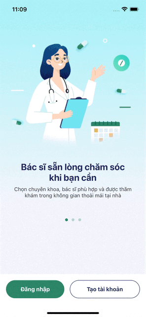
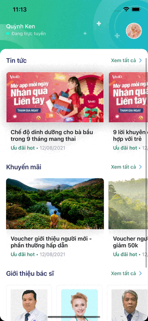
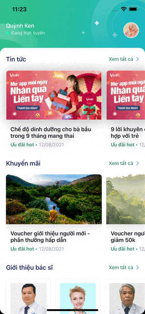

# HealthApp

<!-- PROJECT LOGO -->
 

  

  <h3 align="center">Health App</h3>

  

    An app that provides news related to health and lifestyle
     
    <a href="https://github.com/othneildrew/Best-README-Template"><strong>Explore the docs »</strong></a>
     
     
    <a href="https://github.com/othneildrew/Best-README-Template">View Demo</a>
    ·
    <a href="https://github.com/othneildrew/Best-README-Template/issues">Report Bug</a>
    ·
    <a href="https://github.com/othneildrew/Best-README-Template/issues">Request Feature</a>
  

<!-- ABOUT THE PROJECT -->
## About The Project

This is a small personal project which is developed to enhanced my layout skills and making network call to the API.

(<a href="#readme-top">back to top</a>)

## Preview

| Log in | Home | Sign up |
| :-------: | :-------: | :-------: |
|  |  |  |

(<a href="#readme-top">back to top</a>)

## Contact

- Email: ducanhtran221100@gmail.com
- Github: https://github.com/ducanh2211

(<a href="#readme-top">back to top</a>)
